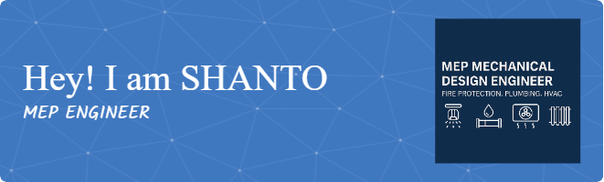

# <h1 align="center">WELCOME TO MY PROFILE</h1>
<h3 align="center"> A passionate MEP Design Engineer || Mechanical Engineer || From Bangladesh</h3>

👨🏼‍💻 Working as a MEP Mechanical Design Engineer since 2024 
✉️ Email Me 👉 **mshanto.me@gmail.com** For Collaboration/Project or Anything Else.

-  **Currently working on:** Shimizu-BGD ARTNATURE NEW PROJECT.
-  **Currently learning:** Supply Chain Management.
-  **Looking to collaborate on:** Your Project to do MEP Mechanical(HVAC, Fire-Safety & Plumbing) Shop or working drawing.
-  **Looking for help with:** Your project here.
-  **Ask me about:** Design, Collaboration and Project Support.

  # 💫 About Me:
Mechanical Design Engineer with 1+ years’ experience in MEP(Mechanical) systems design for high‑rise, commercial, industrial, and residential projects. B.Sc. in Mechanical Engineering from International University of Business Agriculture and Technology(IUBAT) and Associate Member of ASHRAE since 2021. Proficient in AutoCAD (2D) and Revit (3D) for Fire‑Safety, HVAC, and Plumbing designs compliant with NFPA, BNBC, ASHRAE, IPC, PWD and JICA standards. Experienced in load calculations, equipment selection (VRF, chillers, AHUs), tank & pump sizing, and fire‑pump layouts. Strong communicator and team leader with a proven track record of on‑time, on‑budget delivery and high client satisfaction. I have done 20+ project till now.

# 💻 Tech Stack:
             

# 📊 GitHub Stats:

  

  

  

&nbsp;

<h3 align="left">Connect with me:</h3>

