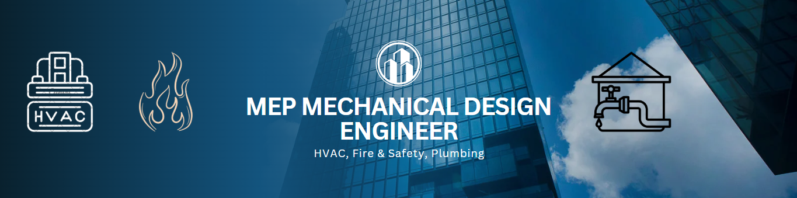

#<h1 align="center"> 💫 Hi 👋, Myself MD. SHAFAYAT ULLAH SHANTO</h1>
**A passionate MEP Design Engineer || Mechanical Engineer || From Bangladesh**

👨🏼‍🎓 Studied BSc in Mechanical Engineering from International University of Business Agriculture and Technology 
👨🏼‍💻 Working as a MEP Mechanical Design Engineer since 2024 
Email Me 👉 ✉️ **mshanto.me@gmail.com** For Collaboration/Project or Anything Else.

-  **I’m currently working on:** Shimizu-BGD ARTNATURE NEW PROJECT
-  **I’m currently learning:** Supply Chain Management
-  **I’m looking to collaborate on:** Your Project to do MEP Mechanical(HVAC, Fire & Safety, Plumbing) Shop or working drawing.
-  **I’m looking for help with:** Your project here
-  **Ask me about:** Design, Collaboration and Project Support

# 💻 Tech Stack:
             

# 📊 GitHub Stats:
 

<picture>
  <source media="(prefers-color-scheme: dark)" srcset="https://raw.githubusercontent.com/mdshafayatullahshanto/mdshafayatullahshanto/output/github-snake-dark.svg" />
  <source media="(prefers-color-scheme: light)" srcset="https://raw.githubusercontent.com/tobiasmeyhoefer/tobiasmeyhoefer/output/github-snake.svg" />
  
</picture>
